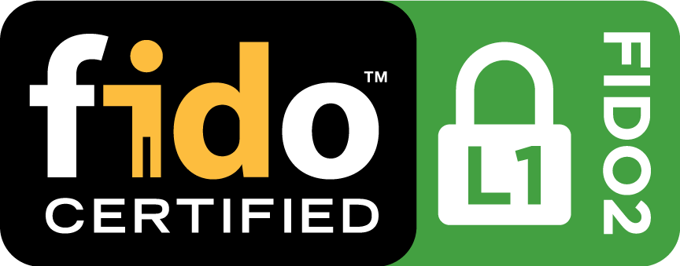

# 


[](https://coveralls.io/github/google/OpenSK?branch=stable)

## OpenSK

This repository contains a Rust implementation of a
[FIDO2](https://fidoalliance.org/fido2/) authenticator.

We developed this as a [Tock OS](https://tockos.org) application and it has been
successfully tested on the following boards:

*   [Nordic nRF52840-DK](https://www.nordicsemi.com/Software-and-Tools/Development-Kits/nRF52840-DK)
*   [Nordic nRF52840-dongle](https://www.nordicsemi.com/Software-and-Tools/Development-Kits/nRF52840-Dongle)

## Disclaimer

This project is **proof-of-concept and a research platform**. It is **NOT**
meant for a daily usage. It's still under development and as such comes with a
few limitations:

### FIDO2

The stable branch implements the published
[CTAP2.0 specifications](https://fidoalliance.org/specs/fido-v2.0-ps-20190130/fido-client-to-authenticator-protocol-v2.0-ps-20190130.html)
and is FIDO certified.



It already contains some preview features of 2.1, that you can try by adding the
flag `--ctap2.1` to the deploy command. The full
[CTAP2.1 specification](https://fidoalliance.org/specs/fido-v2.1-rd-20201208/fido-client-to-authenticator-protocol-v2.1-rd-20201208.html)
is work in progress in the develop branch and is tested less thoroughly.

### Cryptography

We're currently still in the process on making the
[ARM&reg; CryptoCell-310](https://developer.arm.com/ip-products/security-ip/cryptocell-300-family)
embedded in the
[Nordic nRF52840 chip](https://infocenter.nordicsemi.com/index.jsp?topic=%2Fps_nrf52840%2Fcryptocell.html)
work to get hardware-accelerated cryptography. In the meantime we implemented
the required cryptography algorithms (ECDSA, ECC secp256r1, HMAC-SHA256 and
AES256) in Rust as a placeholder. Those implementations are research-quality
code and haven't been reviewed. They don't provide constant-time guarantees and
are not designed to be resistant against side-channel attacks.

## Installation

For a more detailed guide, please refer to our
[installation guide](docs/install.md).

1.  If you just cloned this repository, run the following script (**Note**: you
    only need to do this once):

    ```shell
    ./setup.sh
    ```

1.  Next step is to install Tock OS as well as the OpenSK application on your
    board. Run:

    ```shell
    # Nordic nRF52840-DK board
    ./deploy.py --board=nrf52840dk --opensk
    # Nordic nRF52840-Dongle
    ./deploy.py --board=nrf52840_dongle --opensk
    ```

1.  Finally you need to inject the cryptographic material if you enabled
    batch attestation or CTAP1/U2F compatibility (which is the case by
    default):

    ```shell
    ./tools/configure.py \
        --certificate=crypto_data/opensk_cert.pem \
        --private-key=crypto_data/opensk.key
    ```

1.  On Linux, you may want to avoid the need for `root` privileges to interact
    with the key. For that purpose we provide a udev rule file that can be
    installed with the following command:

    ```shell
    sudo cp rules.d/55-opensk.rules /etc/udev/rules.d/ &&
    sudo udevadm control --reload
    ```

### Customization

If you build your own security key, depending on the hardware you use, there are
a few things you can personalize:

1.  If you have multiple buttons, choose the buttons responsible for user
    presence in `main.rs`.
2.  Decide whether you want to use batch attestation. There is a boolean flag in
    `ctap/mod.rs`. It is mandatory for U2F, and you can create your own
    self-signed certificate. The flag is used for FIDO2 and has some privacy
    implications. Please check
    [WebAuthn](https://www.w3.org/TR/webauthn/#attestation) for more
    information.
3.  Decide whether you want to use signature counters. Currently, only global
    signature counters are implemented, as they are the default option for U2F.
    The flag in `ctap/mod.rs` only turns them off for FIDO2. The most privacy
    preserving solution is individual or no signature counters. Again, please
    check [WebAuthn](https://www.w3.org/TR/webauthn/#signature-counter) for
    documentation.
4.  Depending on your available flash storage, choose an appropriate maximum
    number of supported residential keys and number of pages in
    `ctap/storage.rs`.
5.  Change the default level for the credProtect extension in `ctap/mod.rs`.
    When changing the default, resident credentials become undiscoverable without
    user verification. This helps privacy, but can make usage less comfortable
    for credentials that need less protection.
6.  Increase the default minimum length for PINs in `ctap/storage.rs`.
    The current minimum is 4. Values from 4 to 63 are allowed. Requiring longer
    PINs can help establish trust between users and relying parties. It makes
    user verification harder to break, but less convenient.
    NIST recommends at least 6-digit PINs in section 5.1.9.1:
    https://pages.nist.gov/800-63-3/sp800-63b.html
    You can add relying parties to the list of readers of the minimum PIN length.

### 3D printed enclosure

To protect and carry your key, we partnered with a professional designer and we
are providing a custom enclosure that can be printed on both professional 3D
printers and hobbyist models.

All the required files can be downloaded from
[Thingiverse](https://www.thingiverse.com/thing:4132768) including the STEP
file, allowing you to easily make the modifications you need to further
customize it.

## Development and testing

### Printing panic messages to the console

By default, libtock-rs blinks some LEDs when the userspace application panicks.
This is not always convenient as the panic message is lost. In order to enable
a custom panic handler that first writes the panic message via Tock's console
driver, before faulting the app, you can use the `--panic-console` flag of the
`deploy.py` script.

```shell
# Example on Nordic nRF52840-DK board
./deploy.py --board=nrf52840dk --opensk --panic-console
```

### Debugging memory allocations

You may want to track memory allocations to understand the heap usage of
OpenSK. This can be useful if you plan to port it to a board with fewer
available RAM for example. To do so, you can enable the `--debug-allocations`
flag of the `deploy.py` script. This enables a custom (userspace) allocator
that prints a message to the console for each allocation and deallocation
operation.

The additional output looks like the following.

```text
# Allocation of 256 byte(s), aligned on 1 byte(s). The allocated address is
# 0x2002401c. After this operation, 2 pointers have been allocated, totalling
# 384 bytes (the total heap usage may be larger, due to alignment and
# fragmentation of allocations within the heap).
alloc[256, 1] = 0x2002401c (2 ptrs, 384 bytes)
# Deallocation of 64 byte(s), aligned on 1 byte(s), from address 0x2002410c.
# After this operation, 1 pointers are allocated, totalling 512 bytes.
dealloc[64, 1] = 0x2002410c (1 ptrs, 512 bytes)
```

A tool is provided to analyze such reports, in `tools/heapviz`. This tool
parses the console output, identifies the lines corresponding to (de)allocation
operations, and first computes some statistics:

*   Address range used by the heap over this run of the program,
*   Peak heap usage (how many useful bytes are allocated),
*   Peak heap consumption (how many bytes are used by the heap, including
    unavailable bytes between allocated blocks, due to alignment constraints and
    memory fragmentation),
*   Fragmentation overhead (difference between heap consumption and usage).

Then, the `heapviz` tool displays an animated "movie" of the allocated bytes in
heap memory. Each frame in this "movie" shows bytes that are currently
allocated, that were allocated but are now freed, and that have never been
allocated. A new frame is generated for each (de)allocation operation. This tool
uses the `ncurses` library, that you may have to install beforehand.

You can control the tool with the following parameters:

*   `--logfile` (required) to provide the file which contains the console output
    to parse,
*   `--fps` (optional) to customize the number of frames per second in the movie
    animation.

```shell
cargo run --manifest-path tools/heapviz/Cargo.toml -- --logfile console.log --fps 50
```

## Contributing

See [Contributing.md](docs/contributing.md).

## Reporting a Vulnerability

See [SECURITY.md](SECURITY.md).
