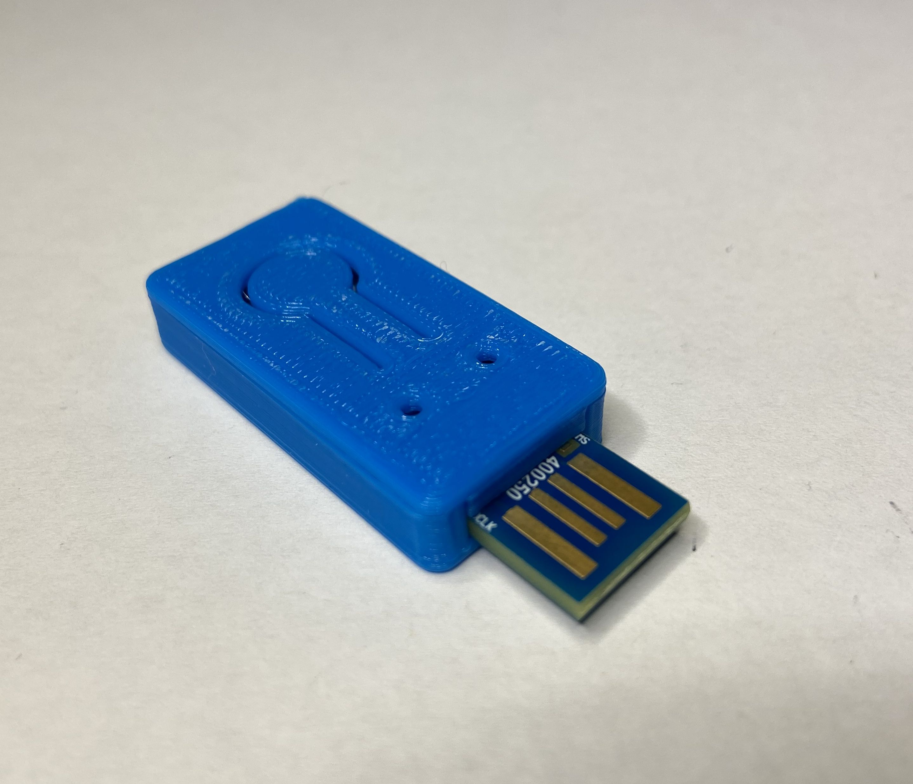

# 


[](https://coveralls.io/github/google/OpenSK?branch=develop)

*News:*

- 2023-08-24: [PQC paper reference](#Research)

## OpenSK

This repository contains a Rust implementation of a
[FIDO2](https://fidoalliance.org/fido2/) security key.
Security keys are external devices that can be used for signing in on websites.
You can see OpenSK in action in this
[video on YouTube](https://www.youtube.com/watch?v=klEozvpw0xg)!

We intend to bring a full open source experience to security keys, from
application to operating system. You can even 3D print your own open source
enclosure!



You can run OpenSK as a [Tock OS](https://tockos.org) application, or use the
library to bring OpenSK to your own hardware.

You are viewing the branch for developers. New features are developed here.
Go to the default branch for a more stable version of OpenSK.

### FIDO2

OpenSK's version that implemented CTAP 2.0 was certified by the FIDO Alliance.

The develop branch tracks the latest release version of the
[CTAP specification](https://fidoalliance.org/specs/fido-v2.2-rd-20230321/fido-client-to-authenticator-protocol-v2.2-rd-20230321.html).
This branch is not FIDO certified.
OpenSK supports U2F, and non-discoverable credentials created with either
protocol are compatible with the other.

### :warning: Disclaimer

This project is **proof-of-concept and a research platform**. It is **NOT**
meant for a daily usage. This branch is under development, and therefore less
rigorously tested than the numbered branches.

We're still in the process of integrating the
[ARM&reg; CryptoCell-310](https://developer.arm.com/ip-products/security-ip/cryptocell-300-family)
embedded in the
[Nordic nRF52840 chip](https://infocenter.nordicsemi.com/index.jsp?topic=%2Fps_nrf52840%2Fcryptocell.html)
to enable hardware-accelerated cryptography.
In the meantime, there are 2 options for cryptography implementations:

*   Our own placeholder implementation. The code is research quality and doesn't
    provide constant-time guarantees.
*   The [RustCrypto](https://github.com/RustCrypto) interface. Deploy with
    `--rust-crypto`. Note that our own ECC implementation is faster and has
    smaller binary size, so not all boards support RustCrypto yet.

## Hardware

You will need one the following supported boards:

*   [Nordic nRF52840-DK](https://www.nordicsemi.com/Software-and-Tools/Development-Kits/nRF52840-DK)
    development kit. This board is more convenient for development and debug
    scenarios as the JTAG probe is already on the board.
*   [Nordic nRF52840 Dongle](https://www.nordicsemi.com/Software-and-tools/Development-Kits/nRF52840-Dongle)
    to have a more practical form factor.
*   [Makerdiary nRF52840-MDK USB dongle](https://wiki.makerdiary.com/nrf52840-mdk/).
*   [Feitian OpenSK dongle](https://feitiantech.github.io/OpenSK_USB/).

## Installation

To install OpenSK,
1.  follow the [general setup steps](docs/install.md),
1.  then continue with the instructions for your specific hardware:
	* [Nordic nRF52840-DK](docs/boards/nrf52840dk.md)
	* [Nordic nRF52840 Dongle](docs/boards/nrf52840_dongle.md)
	* [Makerdiary nRF52840-MDK USB dongle](docs/boards/nrf52840_mdk.md)
	* [Feitian OpenSK dongle](docs/boards/nrf52840_feitian.md)

To test whether the installation was successful, visit a
[demo website](https://webauthn.io/) and try to register and login.
Please check our [Troubleshooting and Debugging](docs/debugging.md) section if you
have problems with the installation process or during development. To find out what
else you can do with your OpenSK, see [Customization](docs/customization.md).

## Research

We implemented post-quantum cryptography on OpenSK. The code is released under
the [hybrid-pqc tag](https://github.com/google/OpenSK/releases/tag/hybrid-pqc).
Our [paper](https://eprint.iacr.org/2022/1225) was published in the ACNS
Secure Cryptographic Implementation workshop 2023 and won the best paper award.

<details>
<summary>Bibtex reference</summary>

```
@InProceedings{Ghinea2023hybrid,
    author= {Diana Ghinea and Fabian Kaczmarczyck and Jennifer Pullman and Julien Cretin and Rafael Misoczki and Stefan Kölbl and Luca Invernizzi and Elie Bursztein and Jean-Michel Picod},
    title=  {{Hybrid Post-Quantum Signatures in Hardware Security Keys}},
    booktitle=  {{4th ACNS Workshop on Secure Cryptographic Implementation, Kyoto, Japan}},
    month=  {June},
    year=   {2023},
}
```

</details>

## Contributing

See [Contributing.md](docs/contributing.md).

## Reporting a Vulnerability

See [SECURITY.md](SECURITY.md).
