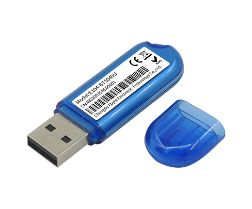

# 

## E104-BT5040U



In fact, this hardware is a cheaper implementation of the [Nordic nRF52840 Dongle](https://www.nordicsemi.com/Software-and-tools/Development-Kits/nRF52840-Dongle), and the vast majority of its circuit mapping is the same or similar to the , so the parameters of the commands below can be directly reused for the Nordic.

### Flashing using DFU (Not recommended)

In fact, the DFU of the E104's nrf52840 chip is corrupted due to a factory firmware issue. You can try to reflash into [an available DFU bootloader](https://github.com/google/OpenSK/issues/545#issuecomment-1292411915) and then use that to flash into OpenSK again.

To flash the firmware, run:

```shell
./deploy.py --board=nrf52840_dongle_dfu --opensk --programmer=nordicdfu
```

The script will ask you to switch to DFU mode. To activate that on your dongle, keep the button pressed while inserting the device into your USB port. You may additionally need to press the tiny, sideways facing reset button. The device indicates DFU mode with a slowly blinking red LED.

### Flashing with an external programmer (JLink, pyOCD, etc.)

If you want to use JTAG with the dongle, you need additional hardware and connect their corresponding ports.

*   a [Segger J-Link](https://www.segger.com/products/debug-probes/j-link/) JTAG
    probe,
*   a [DapLink](https://daplink.io/), etc.

#### JLink

Run our script for compiling/flashing Tock OS on your device:

```shell
$ ./deploy.py --board=nrf52840_dongle --programmer=jlink
```

#### pyOCD

Run the script similar to JLink:

```shell
./deploy.py --board=nrf52840_dongle --opensk --programmer=pyocd
```


Finally, remove the programming cable and the USB-A extension cable.

### Buttons and LEDs

The bigger, white button conveys user presence to the application. Some actions
like register and login will make the dongle blink, asking you to confirm the
transaction with a button press. The small, sideways pointing buttong next to it
restarts the dongle.

The 2 LEDs show the state of the app. There are different patterns:

| Pattern                            | Cause                  |
|------------------------------------|------------------------|
| all LEDs and colors                | app panic              |
| green and blue blinking            | asking for touch       |
| all LEDs and colors for 5s         | wink (just saying Hi!) |
| red slow blink                     | DFU mode               |
