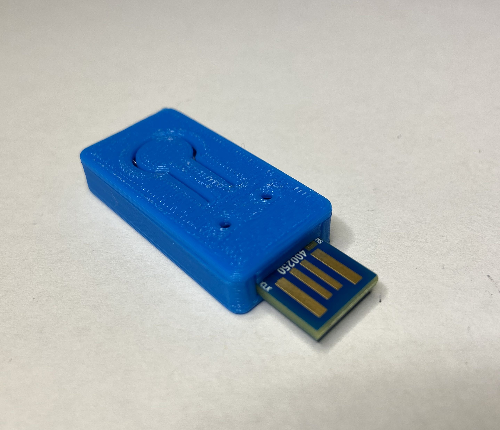

# 

## Nordic nRF52840 Dongle


### 3D printed enclosure

To protect and carry your key, we partnered with a professional designer and we
are providing a custom enclosure that can be printed on both professional 3D
printers and hobbyist models.



All the required files can be downloaded from
[Thingiverse](https://www.thingiverse.com/thing:4132768) including the STEP
file, allowing you to easily make the modifications you need to further
customize it.

### Flashing using DFU (preferred method)

To flash the firmware, run:

```shell
./deploy.py --board=nrf52840_dongle_dfu --opensk --programmer=nordicdfu
```

The script will ask you to switch to DFU mode. To activate that on your dongle,
keep the button pressed while inserting the device into your USB port. You may
additionally need to press the tiny, sideways facing reset button. The device
indicates DFU mode with a slowly blinking red LED.

### Flashing with an external programmer (JLink, OpenOCD, etc.)

If you want to use JTAG with the dongle, you need additional hardware.

*   a [Segger J-Link](https://www.segger.com/products/debug-probes/j-link/) JTAG
    probe.
*   a
    [TC2050 Tag-Connect programming cable](https://www.tag-connect.com/product/tc2050-idc-nl-10-pin-no-legs-cable-with-ribbon-connector).
*   a [Tag-Connect TC2050 ARM2010](http://www.tag-connect.com/TC2050-ARM2010)
    adaptor
*   optionally a
    [Tag-Connect TC2050 retainer clip](http://www.tag-connect.com/TC2050-CLIP)
    to keep the spring loaded connector pressed to the PCB.

Follow these steps:

1.  The JTAG probe used for programming won't provide power to the board.
    Therefore you will need to use a USB-A extension cable to power the dongle
    through its USB port.

1.  Connect the TC2050 cable to the pads below the PCB:

    

1.  You can use the retainer clip if you have one to avoid maintaining pressure
    between the board and the cable:

    

1.  Depending on the programmer you're using, you may have to adapt the next
    command line. Run our script for compiling/flashing Tock OS on your device:

    ```shell
    $ ./deploy.py --board=nrf52840_dongle --programmer=jlink
    ```

1.  Remove the programming cable and the USB-A extension cable.

### Buttons and LEDs

The bigger, white button conveys user presence to the application. Some actions
like register and login will make the dongle blink, asking you to confirm the
transaction with a button press. The small, sideways pointing buttong next to it
restarts the dongle.

The 2 LEDs show the state of the app. There are different patterns:

| Pattern                            | Cause                  |
|------------------------------------|------------------------|
| all LEDs and colors                | app panic              |
| green and blue blinking            | asking for touch       |
| all LEDs and colors for 5s         | wink (just saying Hi!) |
| red slow blink                     | DFU mode               |
