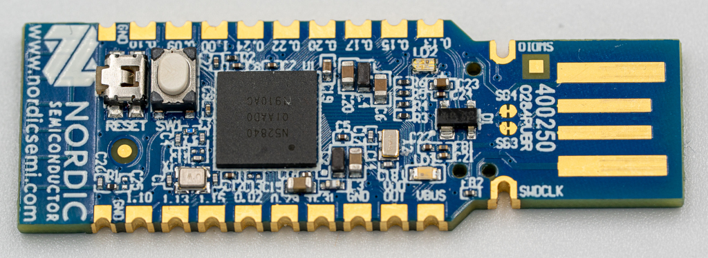
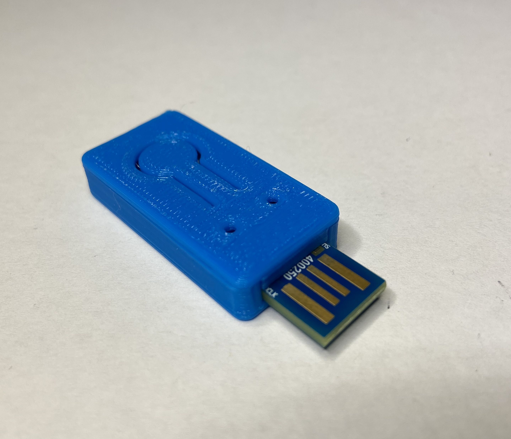

# 

## Nordic nRF52840 Dongle



### 3D printed enclosure

To protect and carry your key, we partnered with a professional designer and we
are providing a custom enclosure that can be printed on both professional 3D
printers and hobbyist models.



All the required files can be downloaded from
[Thingiverse](https://www.thingiverse.com/thing:4132768) including the STEP
file, allowing you to easily make the modifications you need to further
customize it.

### Flashing

Make sure the dongle is in DFU mode by plugging it while holding the reset button.
The device indicates DFU mode with a slowly blinking red LED.

```sh
cargo xtask --release --native \
  applet rust ../.. --opt-level=z --features=ctap1,config-command \
  runner nordic --board=dongle --opt-level=z --features=usb-ctap \
    --features=software-crypto-aes256-cbc,software-crypto-hmac-sha256 \
    --features=software-crypto-p256-ecdsa,software-crypto-p256-ecdh \
  flash
```

This command will eventually pause and instruct you to enter DFU mode again (by
pressing the reset button) then hit Enter to continue.

### Buttons and LEDs

The bigger, white button conveys user presence to the application. Some actions
like register and login will make the dongle blink, asking you to confirm the
transaction with a button press. The small, sideways pointing button next to it
restarts the dongle.

The 2 LEDs show the state of the app. There are different patterns:

| Pattern                      | Cause                  |
|------------------------------|------------------------|
| Green slow blinking          | Asking for touch       |
| Green fast blinking for 5s   | Wink (just saying Hi!) |
| Red slow blink               | DFU mode               |
