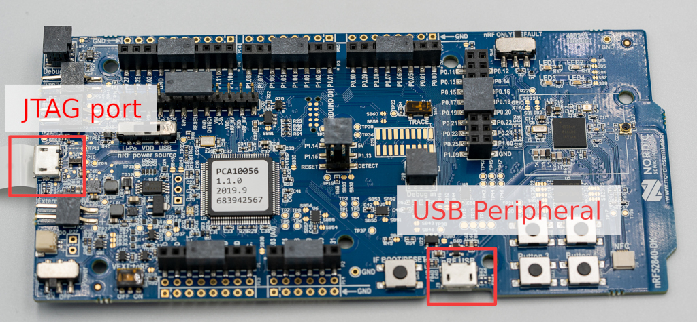

# 

## Nordic nRF52840-DK board



### Flashing

The development board comes with its own JTAG port, so the default programmer
is the easiest and most convenient. You can flash OpenSK with these steps:

After connecting a micro USB cable to the JTAG USB port, run:

```sh
cargo xtask --release --native \
  applet rust opensk --opt-level=z $APPLET_FEATURES \
  runner nordic --opt-level=z --features=usb-ctap $PLATFORM_FEATURES \
    --features=software-crypto-aes256-cbc,software-crypto-hmac-sha256 \
    --features=software-crypto-p256-ecdh,software-crypto-p256-ecdsa \
  flash
```

To use OpenSK, connect a micro USB cable to the device USB port.

### Buttons and LEDs

Out of the 5 buttons, the group of 4 behaves identically. They all convey user
presence to the application. Some actions like register and login will make the
board blink, asking you to confirm the transaction with a button press. The
remaining fifth button restarts the board.

The group of 4 LEDs on the right show the state of the app. There are different
patterns:

| Pattern                            | Cause                  |
|------------------------------------|------------------------|
| LED1 slow blink                    | kernel panic           |
| all LEDs blinking together         | app panic              |
| LED1+4 and LED2+3 fast alternating | asking for touch       |
| fast swirling                      | wink (just saying Hi!) |
| circle                             | allocator panic        |

The LEDs closer to the JTAG port indicates the power and debugging state.

There are 3 switches that need to be in the correct position:

*   Power (bottom left): On
*   nRF power source (center left): VDD
*   SW6 (top right): DEFAULT
