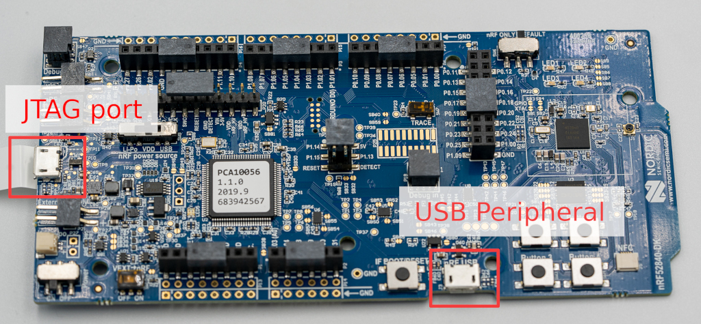
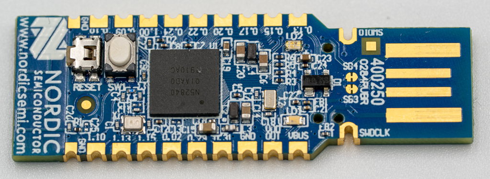
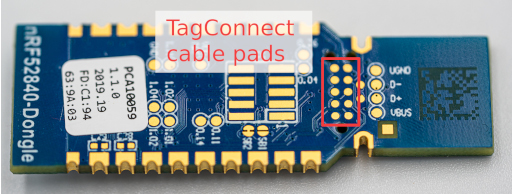
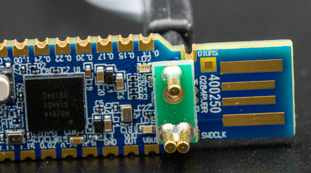

# Installation guide

This document describes in details how to turn a Nordic nRF52840 board into a
working FIDO2 security key.

## Pre-requisite

### Hardware

You will need one the following supported boards:

*   [Nordic nRF52840-DK](https://www.nordicsemi.com/Software-and-Tools/Development-Kits/nRF52840-DK)
    development kit. This board is more convenient for development and debug
    scenarios as the JTAG probe is already on the board.
*   [Nordic nRF52840 Dongle](https://www.nordicsemi.com/Software-and-tools/Development-Kits/nRF52840-Dongle)
    to have a more practical form factor.

In the case of the Nordic USB dongle, you will also need the following extra
hardware:

*   a [Segger J-Link](https://www.segger.com/products/debug-probes/j-link/) JTAG
    probe.
*   a
    [TC2050 Tag-Connect programming cable](https://www.tag-connect.com/product/tc2050-idc-nl-10-pin-no-legs-cable-with-ribbon-connector).
*   a [Tag-Connect TC2050 ARM2010](http://www.tag-connect.com/TC2050-ARM2010)
    adaptor
*   optionally a
    [Tag-Connect TC2050 retainer clip](http://www.tag-connect.com/TC2050-CLIP)
    to keep the spring loaded connector pressed to the PCB.

Although [OpenOCD](http://openocd.org/) should be supported we encountered some
issues while trying to flash a firmware with it. Therefore we suggest at the
moment to use a
[Segger J-Link](https://www.segger.com/products/debug-probes/j-link/) probe
instead.

This guide **does not** cover how to setup the JTAG probe on your system.

### Software

In order to compile and flash a working OpenSK firmware, you will need the
following:

*   rustup (can be installed with [Rustup](https://rustup.rs/))
*   python3 and pip
*   the OpenSSL command line tool

The scripts provided in this project have been tested under Linux and OS X. We
haven't tested them on Windows and other platforms.

## Compiling the firmware

### Initial setup

If you just cloned this repository, you need to run the following script
(_output may differ_):

```shell
$ ./setup.sh
[-] Applying patch "01-persistent-storage.patch"... DONE.
[-] Applying patch "02-usb.patch"... DONE.
[-] Applying patch "03-app-memory.patch"... DONE.
[-] Applying patch "04-rtt.patch"... DONE.
[-] Applying patch "01-linked_list_allocator.patch"... DONE.
[-] Applying patch "02-panic_console.patch"... DONE.
[-] Applying patch "03-timer.patch"... DONE.
[-] Applying patch "04-public_syscalls.patch"... DONE.
[-] Applying patch "05-bigger_heap.patch"... DONE.
[-] Applying patch "06-no_spin_allocator.patch"... DONE.
Signature ok
subject=CN = Google OpenSK CA
Getting Private key
Signature ok
subject=CN = Google OpenSK Hacker Edition
Getting CA Private Key
info: syncing channel updates for 'nightly-2020-02-03-x86_64-unknown-linux-gnu'

  nightly-2020-02-03-x86_64-unknown-linux-gnu unchanged - rustc 1.42.0-nightly (f43c34a13 2020-02-02)

Requirement already up-to-date: tockloader in /usr/lib/python3/dist-packages/tockloader-1.4.0.dev0-py3.7.egg (1.4.0.dev0)
Requirement already satisfied, skipping upgrade: argcomplete>=1.8.2 in /usr/lib/python3/dist-packages (from tockloader) (1.10.0)
Requirement already satisfied, skipping upgrade: colorama>=0.3.7 in /usr/lib/python3/dist-packages (from tockloader) (0.3.7)
Requirement already satisfied, skipping upgrade: crcmod>=1.7 in /usr/lib/python3/dist-packages (from tockloader) (1.7)
Requirement already satisfied, skipping upgrade: pyserial>=3.0.1 in /usr/lib/python3/dist-packages (from tockloader) (3.4)
Requirement already satisfied, skipping upgrade: pytoml>=0.1.11 in /usr/lib/python3/dist-packages (from tockloader) (0.1.21)
info: component 'rust-std' for target 'thumbv7em-none-eabi' is up to date
    Updating crates.io index
     Ignored package `elf2tab v0.4.0` is already installed, use --force to override
```

The script performs the following steps:

1.  Make sure that the git submodules are checked out

1.  Apply our patches that haven't yet been merged upstream to both
    [Tock](https://github.com/tock/tock) and
    [libtock-rs](https://github.com/tock/libtock-rs)

1.  Generate a self-signed certificate authority as well as a private key and a
    corresponding certificate for your OpenSK key signed by this CA. You will be
    able to replace them with your own certificate and private key.

1.  Ensure that your Rust toolchain is using the same version that we tested
    OpenSK with.

1.  Install [tockloader](https://github.com/tock/tockloader).

1.  Ensure that the Rust toolchain can compile code for ARM devices.

### Replacing the certificates

All the generated certificates and private keys are stored in the directory
`crypto_data/`.

This is the expected content after running our `setup.sh` script:

File              | Purpose
----------------- | --------------------------------------------------------
`opensk_ca.csr`   | Certificate sign request for the Root CA
`opensk_ca.key`   | ECC secp256r1 private key used for the Root CA
`opensk_ca.pem`   | PEM encoded certificate of the Root CA
`opensk_ca.srl`   | File generated by OpenSSL
`opensk_cert.csr` | Certificate sign request for the attestation certificate
`opensk_cert.pem` | PEM encoded certificate used for the authenticator
`opensk.key`      | ECC secp256r1 private key used for the autenticator

If you want to use your own attestation certificate and private key, simply
replace `opensk_cert.pem` and `opensk.key` files.

Our build script `build.rs` is responsible for converting `opensk_cert.pem` and
`opensk.key` files into raw data that is then used by the Rust file:
`src/ctap/key_material.rs`.

### Flashing a firmware

#### Nordic nRF52840-DK board



1.  Connect a micro USB cable to the JTAG USB port.

1.  Run our script for compiling/flashing Tock OS on your device (_output may
    differ_):

    ```shell
    $ ./deploy.py os --board=nrf52840_dk
        info: Updating rust toolchain to nightly-2020-02-03
        info: syncing channel updates for 'nightly-2020-02-03-x86_64-unknown-linux-gnu'
        info: checking for self-updates
        info: component 'rust-std' for target 'thumbv7em-none-eabi' is up to date
        info: Rust toolchain up-to-date
        info: Installing Tock on board nrf52840_dk
            Compiling tock-registers v0.5.0 (./third_party/tock/libraries/tock-register-interface)
            Compiling tock-cells v0.1.0 (./third_party/tock/libraries/tock-cells)
            Compiling enum_primitive v0.1.0 (./third_party/tock/libraries/enum_primitive)
            Compiling tock_rt0 v0.1.0 (./third_party/tock/libraries/tock-rt0)
            Compiling nrf52840dk v0.1.0 (./third_party/tock/boards/nordic/nrf52840dk)
            Compiling kernel v0.1.0 (./third_party/tock/kernel)
            Compiling cortexm v0.1.0 (./third_party/tock/arch/cortex-m)
            Compiling nrf5x v0.1.0 (./third_party/tock/chips/nrf5x)
            Compiling capsules v0.1.0 (./third_party/tock/capsules)
            Compiling cortexm4 v0.1.0 (./third_party/tock/arch/cortex-m4)
            Compiling nrf52 v0.1.0 (./third_party/tock/chips/nrf52)
            Compiling nrf52840 v0.1.0 (./third_party/tock/chips/nrf52840)
            Compiling components v0.1.0 (./third_party/tock/boards/components)
            Compiling nrf52dk_base v0.1.0 (./third_party/tock/boards/nordic/nrf52dk_base)
                Finished release [optimized + debuginfo] target(s) in 11.97s
        [STATUS ] Flashing binar(y|ies) to board...
        [INFO   ] Using known arch and jtag-device for known board nrf52dk
        [INFO   ] Finished in 0.284 seconds
    ```

1.  Run our script for compiling/flashing the OpenSK application on your device
    (_output may differ_):

    ```shell
    $ ./deploy.py app --opensk
    info: Updating rust toolchain to nightly-2020-02-03
    info: syncing channel updates for 'nightly-2020-02-03-x86_64-unknown-linux-gnu'
    info: checking for self-updates
    info: component 'rust-std' for target 'thumbv7em-none-eabi' is up to date
    info: Rust toolchain up-to-date
    info: Erasing all installed applications
    All apps have been erased.
    info: Building OpenSK application
        Compiling autocfg v1.0.0
        Compiling pkg-config v0.3.17
        Compiling cc v1.0.50
        Compiling libc v0.2.66
        Compiling bitflags v1.2.1
        Compiling foreign-types-shared v0.1.1
        Compiling openssl v0.10.28
        Compiling cfg-if v0.1.10
        Compiling lazy_static v1.4.0
        Compiling byteorder v1.3.2
        Compiling linked_list_allocator v0.6.6
        Compiling arrayref v0.3.6
        Compiling cbor v0.1.0 (./libraries/cbor)
        Compiling subtle v2.2.2
        Compiling foreign-types v0.3.2
        Compiling libtock v0.1.0 (./third_party/libtock-rs)
        Compiling crypto v0.1.0 (./libraries/crypto)
        Compiling openssl-sys v0.9.54
        Compiling ctap2 v0.1.0 (.)
            Finished release [optimized] target(s) in 15.34s
    info: Flashing padding application
    info: Installing Tock application ctap2
    ```

1.  Connect a micro USB cable to the device USB port.

**Note**: Due to current limitations of our implementation and Tock, you may
have to press the `BOOT/RESET` button, located next to the device USB port on
the board in order to see your OpenSK device on your system.

#### Nordic nRF52840 Dongle



1.  The JTAG probe used for programming won't provide power to the board.
    Therefore you will need to use a USB-A extension cable to power the dongle
    through its USB port.

1.  Connect the TC2050 cable to the pads below the PCB:

    

1.  You can use the retainer clip if you have one to avoid maintaining pressure
    between the board and the cable:

    

1.  Run our script for compiling/flashing Tock OS on your device (_output may
    differ_):

    ```shell
    $ ./deploy.py os --board=nrf52840_dongle
    info: Updating rust toolchain to nightly-2020-02-03
    info: syncing channel updates for 'nightly-2020-02-03-x86_64-unknown-linux-gnu'
    info: checking for self-updates
    info: component 'rust-std' for target 'thumbv7em-none-eabi' is up to date
    info: Rust toolchain up-to-date
    info: Installing Tock on board nrf52840_dongle
        Compiling tock-cells v0.1.0 (./third_party/tock/libraries/tock-cells)
        Compiling tock-registers v0.5.0 (./third_party/tock/libraries/tock-register-interface)
        Compiling enum_primitive v0.1.0 (./third_party/tock/libraries/enum_primitive)
        Compiling tock_rt0 v0.1.0 (./third_party/tock/libraries/tock-rt0)
        Compiling nrf52840_dongle v0.1.0 (./third_party/tock/boards/nordic/nrf52840_dongle)
        Compiling kernel v0.1.0 (./third_party/tock/kernel)
        Compiling cortexm v0.1.0 (./third_party/tock/arch/cortex-m)
        Compiling nrf5x v0.1.0 (./third_party/tock/chips/nrf5x)
        Compiling capsules v0.1.0 (./third_party/tock/capsules)
        Compiling cortexm4 v0.1.0 (./third_party/tock/arch/cortex-m4)
        Compiling nrf52 v0.1.0 (./third_party/tock/chips/nrf52)
        Compiling nrf52840 v0.1.0 (./third_party/tock/chips/nrf52840)
        Compiling components v0.1.0 (./third_party/tock/boards/components)
        Compiling nrf52dk_base v0.1.0 (./third_party/tock/boards/nordic/nrf52dk_base)
            Finished release [optimized + debuginfo] target(s) in 11.72s
        [STATUS ] Flashing binar(y|ies) to board...
        [INFO   ] Using known arch and jtag-device for known board nrf52dk
        [INFO   ] Finished in 0.280 seconds
    ```

1.  Run our script for compiling/flashing the OpenSK application on your device
    (_output may differ_):

    ```shell
    $ ./deploy.py app --opensk
    info: Updating rust toolchain to nightly-2020-02-03
    info: syncing channel updates for 'nightly-2020-02-03-x86_64-unknown-linux-gnu'
    info: checking for self-updates
    info: component 'rust-std' for target 'thumbv7em-none-eabi' is up to date
    info: Rust toolchain up-to-date
    info: Erasing all installed applications
    All apps have been erased.
    info: Building OpenSK application
        Compiling autocfg v1.0.0
        Compiling pkg-config v0.3.17
        Compiling cc v1.0.50
        Compiling libc v0.2.66
        Compiling bitflags v1.2.1
        Compiling foreign-types-shared v0.1.1
        Compiling openssl v0.10.28
        Compiling cfg-if v0.1.10
        Compiling lazy_static v1.4.0
        Compiling byteorder v1.3.2
        Compiling linked_list_allocator v0.6.6
        Compiling arrayref v0.3.6
        Compiling cbor v0.1.0 (./libraries/cbor)
        Compiling subtle v2.2.2
        Compiling foreign-types v0.3.2
        Compiling libtock v0.1.0 (./third_party/libtock-rs)
        Compiling crypto v0.1.0 (./libraries/crypto)
        Compiling openssl-sys v0.9.54
        Compiling ctap2 v0.1.0 (.)
            Finished release [optimized] target(s) in 15.34s
    info: Flashing padding application
    info: Installing Tock application ctap2
    ```

1.  Remove the programming cable and the USB-A extension cable.

### Installing the udev rule (Linux only)

By default on Linux, a USB device will require root privilege in order interact
with it. As it is not recommended to run your web browser with such a high
privileged account, we made a `udev` rule file to allow regular users to
interact with OpenSK authenticators.

To install it, you need to execute the following commands:

```shell
sudo cp rules.d/55-opensk.rules /etc/udev/rules.d/
sudo udevadm control --reload
```

Then, you will need to unplug and replug the key for the rule to trigger.

## Troubleshooting

To test whether the installation was successful, visit a
[demo website](https://webauthn.io/) and try to register and login.

### Linux

If you have issues with the demo website, the following commands should help you
understand whether OpenSK was installed properly.

When plugging in the USB key, the following line should appear in `lsusb`.

```shell
$ lsusb
...
Bus XXX Device YYY: ID 1915:521f Nordic Semiconductor ASA OpenSK
```

You should also see lines similar to the following in `dmesg`.

```shell
$ dmesg
...
[XXX] usb A-BB: new full-speed USB device number 00 using xhci_hcd
[XXX] usb A-BB: New USB device found, idVendor=1915, idProduct=521f, bcdDevice= 0.01
[XXX] usb A-BB: New USB device strings: Mfr=1, Product=2, SerialNumber=3
[XXX] usb A-BB: Product: OpenSK
[XXX] usb A-BB: Manufacturer: Nordic Semiconductor ASA
[XXX] usb A-BB: SerialNumber: v0.1
[XXX] hid-generic 0000:0000:0000.0000: hiddev0,hidraw0: USB HID v1.10 Device [Nordic Semiconductor ASA OpenSK] on usb-0000:00:00.0-00/input0
```

### Mac OS X

If you have issues with the demo website, the following commands should help you
understand whether OpenSK was installed properly.

When plugging in the USB key, you should see a similar line by using the `ioreg`
tool:

```shell
$ ioreg -p IOUSB
+-o Root  <class IORegistryEntry, id 0x100000100, retain 21>
...
  +-o AppleUSBXHCI Root Hub Simulation@14000000  <class AppleUSBRootHubDevice, id 0x100000a00, registered, matched, active, busy 0 (0 ms), retain 9>
    +-o OpenSK@14400000  <class AppleUSBDevice, id 0x100003c04, registered, matched, active, busy 0 (0 ms), retain 13>
```
